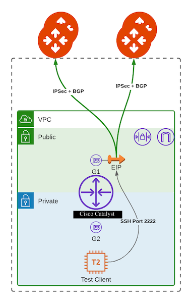

# Aviatrix-Demo-Onprem-AWS

This module simplifies the creation of a Cisco-C8KV in AWS with with External Connections to Aviatrix Gateways for simulating on-prem environments. The resources created by the module are pictured below:



**NOTE**: This module utilizes two different C8KV offer in the AWS Marketplace depending on whether price or performance is prioritized:
- PAYG Offer Link (price): https://aws.amazon.com/marketplace/pp/prodview-o4o5hbn3kjyym?sr=0-2&ref_=beagle&applicationId=AWSMPContessa

# Version 2.0 New Features
- Support for deploying into existing VPC/Subnet
- Added support GRE and BGPoLAN tunnel protocol
- Added HA support and automatic configuration of remote_ha
- Ability to mix BGPoLAN connection type with Public IPsec conns to simulate SD-WAN
- Ability to pick primary/ha AZs

# Instructions

This Module requires the AWS and Aviatrix Provider to be defined and configured in the root module. The Module automatically creates the external S2C connections from the Catalyst to the specified Aviatrix Transit gateways and configures the Catalyst with the correct crypto settings, BGP settings, and Tunnels. Module invocation looks like so:

```terraform
# Optionally, create multiple aliased providers to deploy Catalysts across multiple regions
provider "aws" {
	alias   = "use1"
	region  = "us-east-1"
}

provider "aws" {
	alias   = "usw2"
	region  = "us-west-2"
}

# Call the Module and provide necessary info.
# public connections (using public IP) and private connections (e.g., using DX) 
# are defined separately to allow mix-and-match.
# format for the connection definition is: 
# "avx-gw-name:avx-gw-bgp-as:num-vrfs"
# NOTE: Please currently set num vrfs to 1. It is reserved for future use

provider "aws" {
  region = "us-east-2"
}

module "demo-onprem-1" {
  source                                = "github.com/pbomma-avx/aviatrix-catalyst-aws?ref=main"
  hostname                              = "avxOnprem-East2"
  tunnel_proto				= "IPsec"
  instance_type                         = "t3.medium"
  tunnel_proto        = "IPsec"
  key_name            = "avx-ohio"
  network_cidr        = "10.200.0.0/23"
  public_subnets      = ["10.200.0.0/25"]
  private_subnets     = ["10.200.1.0/25"]
  instance_type       = "t3.medium"
  public_conns        = ["aws-transit:64525:1"]
  catalyst_bgp_as_num = "64527"
  create_client       = true
}

module "demo-onprem-1" {
  source                                = "github.com/pbomma-avx/aviatrix-catalyst-aws?ref=main"
  providers                             = { aws = aws.use1 }
  hostname                              = "avxOnprem-East1"
  tunnel_proto				= "IPsec"
  network_cidr                          = "172.16.0.0/16"
  public_subnets                        = ["172.16.0.0/24","172.16.1.0/24"]
  private_subnets			= ["172.16.2.0/24","172.16.3.0/24"]
  advertised_prefixes                   = ["10.20.0.0/16","10.30.0.0/16"]
  instance_type                         = "t3.medium"
  public_conns                          = [ "Test-Transit:64525:1", "TestWest-Transit:64526:1"]
  private_conns                         = [ "Test-Transit:64525:1" ]
  catalyst_bgp_as_num                        = "64527"
  create_client                         = true
}

# Example of BGPoLAN connection with a Aviatrix sandwich
# Existing subnet/id's are provided for the BGPoLAN/Catalyst's
# public conns are defined to connect to another aviatrix transit
# acting as the on-prem sd-wan
module "demo-onprem-2" {
  source                                = "github.com/pbomma-avx/aviatrix-catalyst-aws?ref=main"
  providers                             = { aws = aws.usw2 }
  hostname                              = "avxOnprem-West2"
  tunnel_proto				= "LAN"
  network_cidr                          = "172.31.0.0/16"
  public_subnet_ids                     = ["subnet-123abc","subnet-234def"]
  bgpolan_subnet_ids                    = ["subnet-567ghi","subnet-890jkl"]
  advertised_prefixes                   = ["10.20.0.0/16","10.30.0.0/16"]
  instance_type                         = "t3.medium"
  public_conns                          = [ "Test-Onprem:64433:1"]
  private_conns                         = [ "Test-SDWAN-Transit:64525:1" ]
  catalyst_bgp_as_num                        = "64528"
}
```

Example of getting outputs:

```terraform
# Get Public IP of Catalyst
output "CatalystEast1_Pub_IP" {
  value = module.demo-onprem-1.public_ip
}

# Get command to directly SSH into the Catalyst via IP
# Ex: ssh -i private_key.pem ec2-user@<Catalyst Public IP>
output "CatalystEast1_SSH_Cmd" {
    value = module.demo-onprem-1.ssh_cmd_catalyst
}

# Get command to ssh into test client via forwarded port
# Ex: ssh -i private_key.pem ec2-user@<Catalyst IP> -p 2222
output "CatalystEast1_SSH_Cmd_Client" {
    value = module.demo-onprem-1.ssh_cmd_client
}

# Get generated Catalyst configuration/user_data for debugging
output "CatalystEast1_User_Data" {
    value = module.demo-onprem-1.user_data
}
```

Explanation of module arguments:

- **aws_region:** The AWS region into which to deploy the Catalyst1K.
- **hostname:** The hostname which will be configured on the Catalyst and which will prefix all of the resources created.
- **key_name:** If you have an existing SSH key in AWS which you would like to use for the Catalyst & test client login you can put the name here. Catalyst will automatically be provisioned an admin user with a password of: Password123!
- **network_cidr:** The CIDR block to use for the VPC which the Catalyst will reside in.
- **az1:** Primary Catalyst/Aviatrix gateway availability zone (default a)
- **az2:** Secondary Catalyst/Aviatrix gateway availability zone (default b)
- **tunnel_proto:** Which tunnel protocol to use for creating Aviatrix tunnels to Catalyst. Valid values: "IPsec", "GRE", "LAN"
- **public_subnets:** The list of public subnets for the Catalyst public facing interface. One value here will create a Catalyst without HA, putting two values will create HA Catalysts.
- **private_subnets:** The list of private subnets for the Catalyst private facing interface. One value here will create a Catalyst without HA, putting two values will create HA Catalysts.
- **public_subnet_ids:** The list of existing public subnet ids for the Catalyst public facing interface. One value here will create a Catalyst without HA, putting two values will create HA Catalysts.
- **private_subnet_ids:** The list of existing private subnet ids for the Catalyst private facing interface. One value here will create a Catalyst without HA, putting two values will create HA Catalysts.
- **bgpolan_subnet_ids:** Existing BGPoLAN subnet ids to create Catalyst LAN interface inside of.
- **advertised_prefixes:** Custom list of prefixes to advertise to Aviatrix Transit. Will create static routes to Null0 for these prefixes on the Catalyst and redistribute static to BGP.
- **instance_type:** The instance type to launch the Catalyst with. Default is t2.medium.
- **public_conns:** List of public external connection definitions (please see above example for format). Tunnels will be created to primary and hagw automatically.
- **private_conns:** List of private external connection definitions (For DX, please see above example for format). Tunnels will be created to primary and hagw automatically.
- **Catalyst_bgp_as_num:** BGP AS Number to use on the Catalyst.
- **create_client (optional):** If enabled, creates an amazon linux instance in the private subnet, configures public SG to allow port 2222 and configures a port forward on the Catalyst to allow SSH into the test instance using the Catalyst IP and port 2222. SSH Key used for the instance will either be the one specified in key_name or generated automatically. Disabled by default.

Module outputs:

- **public_ip:** Public IP of Catalyst instance
- **hostname:** Hostname of Catalyst Instance
- **ssh_cmd_catalyst:** SSH Command to directly access the Catalyst
- **ssh_cmd_client:** SSH Command to access the test client
- **user_data:** Generated Catalyst bootstrap IOS configuration.
